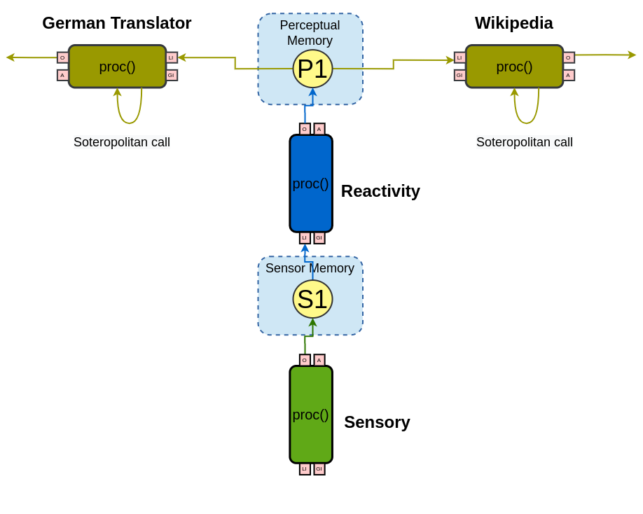

# CST Rest Example

This repo contains an example of the use of [CST](https://github.com/CST-Group/cst) REST API, integrating Python code on CST's Java implementation.

The ANA (acronymous for API Newbie Agent) will read a list of tasks in a JSON-formatted file (tasks.json) and will print either the English to German translation of a list of sentences or the 1000 first characters of a Wikipedia page's summary about a given subject.
 
 ## How it works

First, you'll need to activate the virtual environment in this repo by running the following command, from the project's root folder:

    ./venv/bin/activate

Then the Flask API server must be run with `IP:port` arguments:
    
    python3 soteropolitan.py 127.0.0.1:5000

Notice that we used localhost and port 5000, but this may be customized by changing both the Python script`s arguments and the Java agent's internal (hardcoded) parameter.

After that, running the Java program will execute the proposed example.

### What is going on?

Internally, the Sensory Codelet read the tasks.json file and passes the tasks one by one to the Reactivity Codelet as an entry in a HashMap. The Reactivity will then pass this info to either GermanTranslation on Wikipedia Codelet, according to the task. Those Codelets will make a GET or POST request - Wikipedia and GermanTranslator, respectively - and print the response given by the server in the terminal. The figure below illustrates the Agent's topology.

